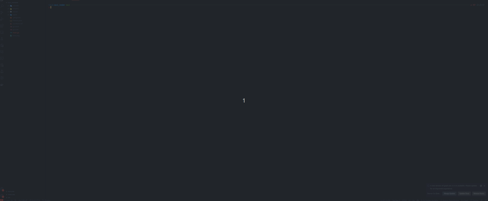

# ASCII Render Library

The ASCII Render Library is a Golang library that helps you create ASCII art from images and text. This library can also convert your ASCII art into images.



This library is composed of three main packages:

1. `helpers` provides utilities for file operations, such as saving images to files.
2. `render` provides functions for creating ASCII art.
3. `types` contains the data types used by the other packages.

**An important feature of this project is that it has zero dependencies, making it lightweight and easy to integrate into your existing projects.**

## Installation

To install this library, you can use `go get`:

```bash
go get github.com/lguibr/asciiring
```

## `helpers` package

The `helpers` package provides the following functions:

- `SaveImageToFile(img *image.RGBA, path string) error`: This function saves an image to the file system. It accepts an image and a path to save the image, and returns an error if any issues occur during saving.

- `ClearScreen()`: This function clears the terminal screen.

## `render` package

The `render` package provides the following functions:

- `CreateTextImage(text string, lineHeight, charWidth int) *image.RGBA`: This function creates an image from a string of text. It accepts the text to render, the line height, and the character width, and returns the created image.

- `ImageToRGBArray(img image.Image) [][]types.RGBPixel`: This function converts an image into a 2D slice of RGB pixels. It accepts an image and returns the 2D slice of pixels.

- `RenderToASCII(pixels [][]types.RGBPixel, resolution int, color *types.RGBPixel) string`: This function converts a 2D slice of types.RGBPixels to an ASCII string. It accepts a 2D slice of pixels, a resolution, and an RGB color, and returns the generated ASCII string.

## `types` package

The `types` package contains the `RGBPixel` type, which is used by the `render` package to represent pixels.

```go
type RGBPixel struct {
    R uint8
    G uint8
    B uint8
}
```

## Usage

```go
package main

import (
    "github.com/lguibr/asciiring/helpers"
    "github.com/lguibr/asciiring/render"
    "github.com/lguibr/asciiring/types"
    "image"
)

func main() {
    // Create an ASCII art
    text := "Hello, world!"
    img := render.CreateTextImage(text, 10, 10)
    helpers.SaveImageToFile(img, "path/to/file.png")

    // Convert the image to ASCII art
    pixels := render.ImageToRGBArray(img)
    color := types.RGBPixel{R: 255, G: 255, B: 255} // White color
    ascii := render.RenderToASCII(pixels, 70, &color)
    fmt.Println(ascii)
}
```
